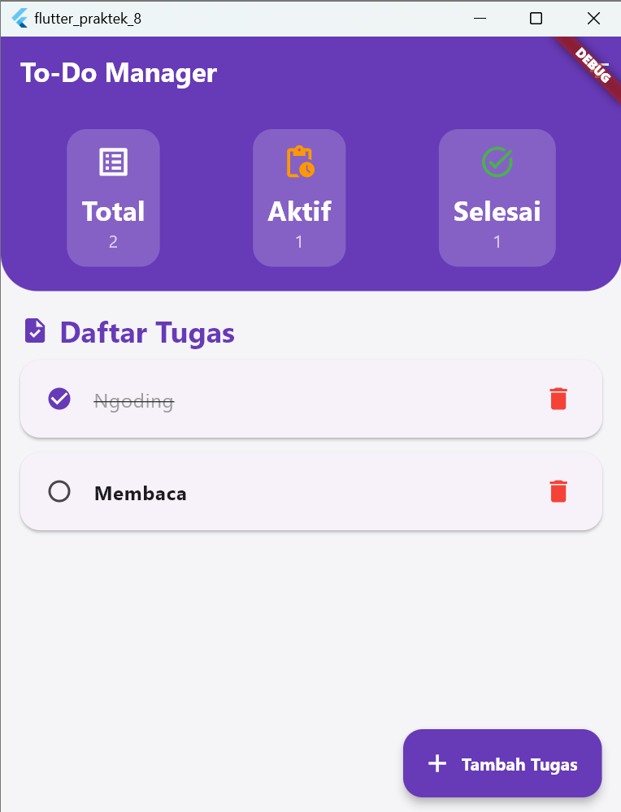
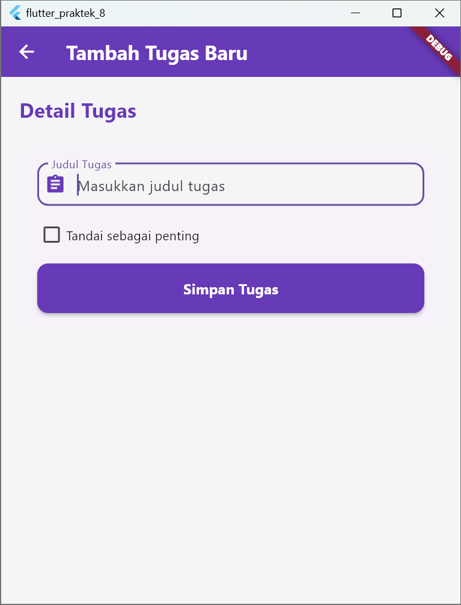

# 📘 Todo List

Deskripsi singkat tentang aplikasi. Misalnya:

> Aplikasi ini merupakan sistem untuk membantu user memanajemen kegiatan sehari-hari.

---

## 🚀 Fitur Utama

- 📋 Menambah Kegiatan
- 📋 Menghapus Kegiatan
- 📋 Menandai Kegiatan Penting

---

## 📸 Tampilan Setiap Halaman

### 1. Home



### 2. Tambah Kegiatan



---

## 💻 Cara Instalasi

```bash
git clone https://github.com/username/nama-proyek.git
cd nama-proyek
flutter clean
flutter pub-get
flutter run
```
